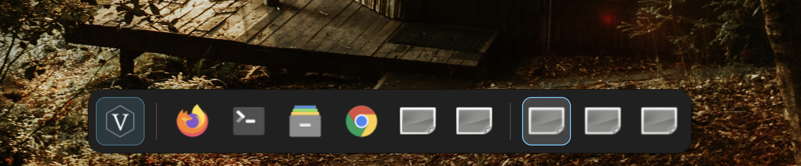

# Vantusk

Floating taskbar/dock for Vantum. Companion to Vantyl (the app launcher).

## What it does (v1 scope)

- Shows currently running windows as a floating, auto-sizing dock,
  centered at the bottom of the primary monitor.
- Click a tile to activate/raise its window; click again to minimize.
- Window list and live updates (open/close/active-state) come from
  **libwnck** (GTK's EWMH/`_NET_WM_*` window-navigator library).
- Optionally cross-references Vantyl's `/tmp/processz.tmp` pid map to
  show a friendlier app name where available. This is best-effort only,
  not load-bearing — Wnck's own window title is the fallback and is
  usually fine on its own (see note below on why the pid match is
  unreliable for a lot of apps).

## Requirements

- Linux, X11, a window manager that implements EWMH properly (JWM does).
- GTK3 + PyGObject.
- **libwnck 3 + its GObject introspection typelib.** This is the one
  that trips people up:
  - Debian/Ubuntu/Puppy-derivatives: `gir1.2-wnck-3.0`
  - Fedora: `libwnck3` (+ introspection subpackage if split)
  - Arch: `libwnck3`
  - **macOS: not available.** libwnck talks to an X11 WM's EWMH
    properties; there's no X11 WM under macOS by default, and libwnck
    isn't in Homebrew. Don't try to run this natively on Mac.

## Why not just develop on macOS?

Vantusk's entire job is to query a live X11 window manager. There's
nothing to query on macOS. Develop/test on:

- The Multipass Linux VM (already set up for BeasOS work), or
- The JWM + Xephyr sandbox (already set up for Vantyl config work), or
- Directly on the Dell Latitude / HP EliteBook BeasOS boots.

## Known limitations / not yet implemented

- Single monitor only (always positions on the primary monitor).
- No drag-to-reorder tiles.
- No right-click context menu (close/pin/etc).
- Dock shrinks to near-nothing when zero windows are open — no
  placeholder state yet.
- pid-based name lookup misses apps that fork/re-exec (e.g. Chrome) or
  are launched outside Vantyl entirely — expected, not a bug to chase.

## Files

- `vantask.py` — the dock itself.
- `mockWnck.py` — Since Wnck doesn't exist on macos, this is a test module that mimics the Wnck for testing.

## Autostart (JWM)

Not wired up yet. When ready, add a launch line to `.jwmrc`'s startup
section (same place Vantyl's XML sandbox config lives) so Vantusk comes
up alongside the desktop session.